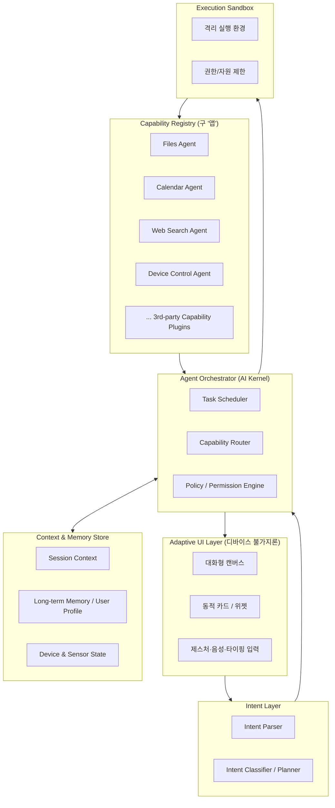

# AI-Native OS 개념 아키텍처

> "앱(App)"이 아니라 "의도(Intent)"를 실행 단위로 삼는 운영체제.
> 사용자는 아이콘을 눌러 프로세스를 실행하는 대신, 자연어/제스처/컨텍스트로 의도를 표현하고
> OS 내부의 에이전트 오케스트레이터가 필요한 능력(Capability)을 동적으로 조합해 실행한다.

## 1. 레이어 구조



## 2. 레이어별 설명

### Intent Layer
- 입력(텍스트/음성/제스처/센서 이벤트)을 구조화된 의도(intent + slot)로 변환
- 다중 의도 분해(예: "회의 잡고 관련 자료 찾아줘" → [일정 생성, 웹/문서 검색])
- 모호성 해소를 위해 UI에 되묻는 절차 포함 가능

### Agent Orchestrator (AI 커널)
- 기존 OS의 프로세스 스케줄러 역할을 대체하는 "태스크 스케줄러"
- Capability Router: 의도를 어떤 Capability(들)에 매핑할지 결정 (LLM 기반 라우팅 + 규칙 기반 라우팅 혼합)
- Policy/Permission Engine: 기존 OS의 권한 모델(파일 접근, 디바이스 접근)을 에이전트 단위로 적용

### Capability Registry (앱을 대체하는 개념)
- 기존 "설치된 앱" 대신 "등록된 능력(Capability)"의 목록
- 각 Capability는 입출력 스키마, 필요 권한, 신뢰도(공식/서드파티) 메타데이터를 가짐
- 여러 Capability가 조합되어 하나의 의도를 처리 (에이전트 체이닝)

### Context & Memory Store
- Session Context: 현재 대화/작업 흐름의 단기 기억
- Long-term Memory: 사용자 선호, 습관, 반복 패턴 학습
- Device & Sensor State: 위치, 배터리, 연결된 기기 등 실시간 상태 (이전 대화에서 다룬 실내측위/센서 데이터와 연동 가능)

### Execution Sandbox
- Capability 실행을 격리된 환경에서 수행 (기존 OS의 프로세스 격리와 유사하지만 "권한 스코프"가 더 세분화됨)
- 실행 결과에 대한 신뢰도 검증 (LLM 환각 방지, 이상행동 탐지)

### Adaptive UI Layer
- 고정된 아이콘 그리드 대신, 의도 처리 결과에 따라 동적으로 카드/위젯이 생성되는 "대화형 캔버스"
- 디바이스 폼팩터(데스크톱/모바일)에 따라 같은 카드가 레이아웃만 다르게 렌더링됨 (반응형 원칙을 UI 패러다임 자체에 적용)

## 3. UI 개념도 (앱 아이콘 → 의도 카드)

```mermaid
flowchart LR
    U[사용자 입력: "내일 오후 3시에 팀 회의 잡고, 관련 자료 찾아줘"]
    U --> P[Intent Parser]
    P --> T1[Task: Calendar 생성]
    P --> T2[Task: Web/Doc 검색]
    T1 --> CardA[카드: 회의 일정 확인/수정 UI]
    T2 --> CardB[카드: 검색결과 요약 + 원문 링크]
    CardA --> Canvas[대화형 캔버스에 나란히 배치]
    CardB --> Canvas
```

- 앱을 "실행"하는 게 아니라 결과를 "카드"로 받고, 카드 안에서 세부 조작(수정/승인/취소)을 함
- 여러 카드가 하나의 캔버스에 쌓이며, 필요 시 카드끼리 데이터 드래그&드롭으로 연결 가능 (예: 검색 카드의 링크를 회의 카드의 첨부파일로)

## 4. 기존 OS 대비 차이점 요약

| 구분 | 기존 OS | AI-Native OS |
|---|---|---|
| 실행 단위 | 프로세스/앱 | 의도(Intent) → Capability 조합 |
| 사용자 인터페이스 | 아이콘/윈도우 | 대화형 캔버스 + 동적 카드 |
| 확장 방식 | 앱 설치 | Capability 등록/플러그인 |
| 권한 모델 | 앱 단위 권한 | 의도/태스크 단위 세분화된 권한 |
| 상태 관리 | 앱별 로컬 상태 | 통합 Context/Memory Store |
| 폼팩터 대응 | 앱마다 별도 UI 개발 | 동일 카드의 반응형 렌더링 |
