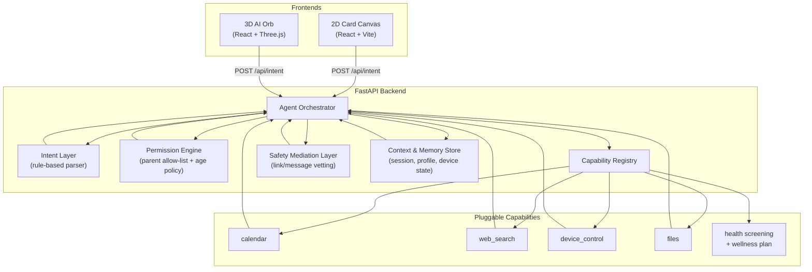
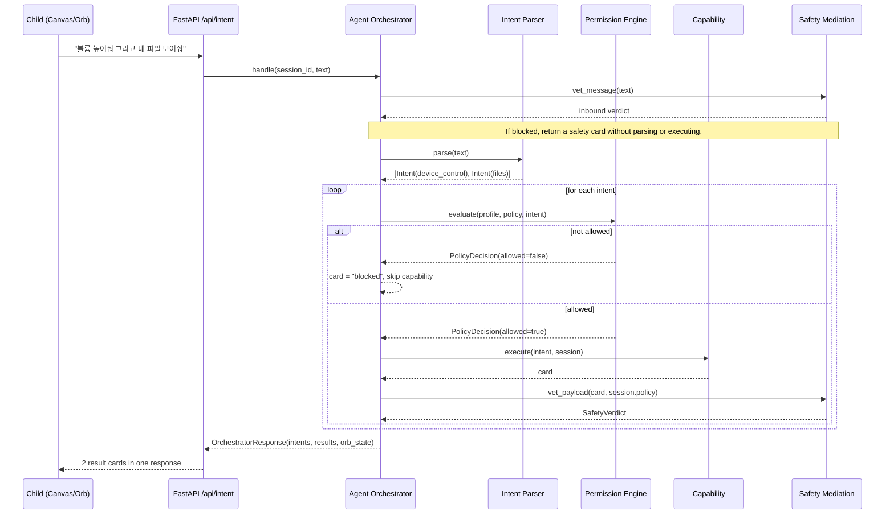
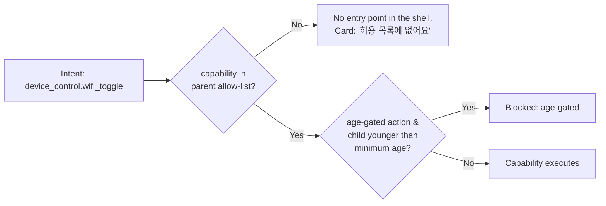

# AIOS Guardian — Architecture

## 1. System Overview

Every capability response is routed through the **same** Safety Mediation Layer
instance to inspect nested links and messages before returning it to a frontend.
The orchestrator also checks the incoming utterance before parsing any intents.
This protects the shell's request/result path; it is not Windows-wide enforcement.
Result inspection happens after `execute()`, so it cannot prevent side effects
already performed by a capability. Real external writes need a separate
pre-execution argument check and approval gate.

## 2. Request Sequence — Multi-Intent Decomposition

## 3. Allow-List Enforcement (Not a Block-List)

Because policy lives in the orchestrator (`app/policy/engine.py`) rather than in
each capability, a parent configures posture once (`PUT /api/policy/{session_id}`)
and it applies uniformly — including to capabilities registered later through the
same `CapabilityRegistry`.

## 4. Component Responsibilities

| Component | File | Responsibility |
|---|---|---|
| Intent Layer | `backend/app/intent/parser.py` | Splits an utterance into 1+ structured `Intent`s (rule-based today; swappable for an LLM later) |
| Agent Orchestrator | `backend/app/orchestrator/orchestrator.py` | Routes each intent through policy → capability → safety, in that order, before returning results |
| Capability Registry | `backend/app/capabilities/` | Pluggable "apps"; each capability only implements `execute(intent, session)` |
| Permission Engine | `backend/app/policy/engine.py` | Parent allow-list + age-gated actions, evaluated *before* execution |
| Safety Mediation Layer | `backend/app/safety/mediation.py` | Vets every inbound utterance and all nested capability URLs/messages for phishing, impersonation, urgency, transfer, credential, remote-access, domain, and URL risks |
| Context & Memory Store | `backend/app/memory/store.py` | Session-scoped profile, policy, conversation history, device state, calendar, files |
| Health Screening | `backend/app/health/service.py` | Document Intelligence OCR, measurement normalization, risk flags, and seven-day wellness cards |
| 2D Card Canvas | `frontend-canvas/` | Adaptive-card style chat canvas + parent settings panel |
| 3D AI Orb | `frontend-orb/` | Three.js orb with idle/listening/thinking/speaking face states and orbiting capability icons |

## 5. What's Deliberately Out of Scope for This Hack

- LLM-based intent parsing (current parser is rule-based; the `Intent` contract
  is designed so an LLM-backed parser is a drop-in replacement)
- Actually hosting YouTube/browser/Copilot/Office as in-shell panes
- Real OS-level device control (the `device_control` capability simulates state)
- On-device attention sensing
- Voice in/out
- Production health-data persistence, FHIR integration, provider authentication,
  and generated image/video model deployment

## 6. Proposed Cross-App Extension

The [Korean hackathon scenario](hackathon-scenario-ko.md) separates existing
capabilities in this repository and the related labs from proposed integration.
Its target flow is plan -> scoped data access -> preview -> approval -> final
policy/argument check -> adapter execution -> result receipt. This approval flow,
real calendar writes, and the Translator event adapter are not implemented here.
