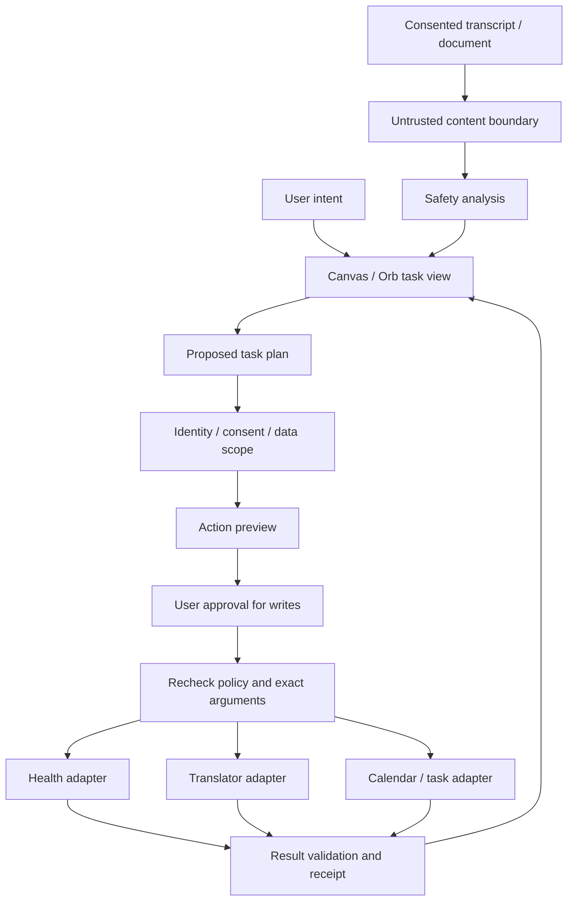

# AIOS Guardian: 승인 기반 생활·업무 AI 셸

검토일: 2026-09-14

> 앱을 하나씩 조작하는 대신 원하는 결과를 말하면, AI가 작업을 제안하고 사용자가 승인한 범위에서 연결한다. 건강·회의·안전 기능은 같은 작업 화면을 사용하되 서로의 민감정보를 자동으로 공유하지 않는다.

이 문서는 해커톤 시나리오와 목표 구조를 설명한다. 후속 구현으로 아래 공통 작업 UI와 로컬 어댑터가 추가되었다. 외부 운영 서비스까지 모두 구현됐다는 의미는 아니다.

## 후속 구현 현황

- `frontend-canvas`의 기본 화면은 작업 공간·회의·건강·안전·기억·설정 6개 뷰로 교체했다.
- 세션 인증, 목적별 동의, 실행 전 인자 지문 검증·승인·취소·만료·중복 방지·결과 영수증을 구현했다.
- 회의 근거 기반 후보와 본인 발화 학습, Translator 확정 자막 읽기 전용 연결, 최근 자막 안전 검사를 추가했다.
- Health Lab 운동·식단 프로그램 가져오기, 로컬 일정 빈 시간 추천, 민감정보 없는 개인 일정 등록을 추가했다.
- 세션 내 정책 PIN·알림·감사 기록·선택적 기억·삭제·8시간 만료를 구현했다. 보호자 외부 전송과 운영 인증은 미구현이다.
- 일정 쓰기는 **세션 로컬 메모리**에만 반영된다. Graph/Outlook/To Do, 공식 Teams 봇, FHIR/웨어러블, Windows 전체 제어는 남아 있다.
- AI 미구성 시 규칙 경로를 표시한다. Health Lab과 Translator는 별도 실행이 필요하며 실제 서비스 연결 여부와 오류를 표시한다.

실행은 프로젝트 루트의 `run.ps1`, 세부 범위와 삭제 경계는 [README](../README.md)를 따른다. 아래 시나리오와 우선순위 표에는 장기 목표도 포함되므로 완료 판단은 이 현황을 기준으로 한다.

## 1. 발표 방향

기존 아동용 Guardian의 강점인 허용 목록과 안전 중재를 유지하면서, 주 시연 대상은 **해외 회의가 잦고 건강관리가 필요한 성인 사용자 한 명**으로 좁힌다. 아동·보호자 시나리오는 같은 정책 구조를 활용하는 확장 사례로 제시한다.

핵심은 통역·건강·검색을 한 화면에 모으는 것이 아니라, **하나의 목표를 여러 기능에 걸친 작업으로 바꾸고 실행 권한과 결과를 추적하는 것**이다.

| 발표 질문 | 권장 답변 |
|---|---|
| 왜 AI OS인가? | 앱 아이콘 대신 목표와 작업 상태를 첫 화면으로 제공하는 Windows 위의 에이전트 셸이다. 새 운영체제 커널은 아니다. |
| 일반 챗봇과 무엇이 다른가? | 답변에서 끝나지 않고 계획, 권한 확인, 실행 미리보기, 승인, 실행 결과 확인으로 이어지는 경험을 목표로 한다. |
| 기존 제품 세 개와 무엇이 다른가? | 각 제품은 전문 기능을 담당하고, 셸은 작업 연결·승인·취소·정보 공유 범위를 담당한다. 로컬 연결은 구현했으며 외부 운영 연동은 남아 있다. |
| 다른 Copilot보다 우수한가? | 포괄적 우위를 주장하지 않는다. 이 프로토타입에서는 앱 간 흐름과 승인·데이터 경계를 눈으로 검증할 수 있다는 점을 보여준다. |
| Windows 전체를 보호하는가? | 아니다. 연결된 어댑터와 셸을 통과하는 작업만 통제한다. 외부 앱·통화·송금을 OS 차원에서 차단하지 않는다. |

## 2. 현재 자산과 실제 공백

아래 '확인'은 문서 또는 코드 존재 확인이며, 운영 품질이나 배포 성공을 보증하지 않는다.

| 자산 | 확인한 내용 | 통합 시 남은 작업 |
|---|---|---|
| 원본 AIOS Guardian | 규칙 기반 다중 의도, 허용 목록·연령 정책, 입력 피싱 검사, 중첩 결과 검사, Canvas/Orb와 건강검진 흐름 | 실제 외부 작업 어댑터, 사용자 인증, 승인·취소·실행 기록 |
| AIOS Guardian Extended Lab | 별도 프로젝트. README에 LLM 의도 분류와 폴백 설명. 코드에 통화 문맥 분석 `/api/safety/monitor`, 알림 조회, 보호자 알림 호출 존재 | 원본과 기능 차이 정리, Translator 연결, 알림 수신자 검증·동의, 실제 전송 확인 |
| AI Health Lab | 검진 추출·사용자 확인, AI 운동·식단 후보와 규칙 기반 선택, 추세·목표·활동 기록, 팬트리·식료품 사진 API, 로컬 보관 | 셸용 제한된 데이터 계약, 일정 연동, 공개할 필드 선택 |
| Teams Translator | 시스템·마이크 입력, 번역·답변 초안, 발화 교정·언어 프로필, 문서 대화, 음성 모드, 선택적 로컬 이벤트 저장 코드 | 확정 자막 어댑터, 업무 후속 작업 추출, 셸에서의 수집·저장 동의 |
| Teams Agent / Graph 미디어 봇 | README에는 설명되지만 이번 대상 폴더 목록에는 해당 소스 디렉터리가 보이지 않음 | 다른 경로에 있는지와 실제 배포 상태를 별도 확인. 해커톤 완성 기능으로 제시하지 않음 |

### 우선 바로잡을 설명

1. 원본 README의 허용 목록 콘솔·그림형 Q&A·피싱 중재는 이미 소개된 기능이다. '앞으로 구현' 목록과 중복시키지 않는다.
2. 원본과 Extended Lab은 코드를 공유하지 않는 별도 프로젝트다. 한쪽 기능이 다른 쪽에도 자동 반영됐다고 설명하지 않는다.
3. Translator README의 '파일 저장 없음'은 현재 코드와 다르다. 기본 저장은 꺼져 있지만 켜면 JSONL로 저장하며, 켜기 전 메모리 이력도 저장하는 경로가 있다. 통합 UI에서는 '지금부터 저장'과 '이전 내용 포함'을 분리하는 것이 필요하다.
4. 현재 오케스트레이터는 `capability.execute()` 뒤에 결과를 검사한다. 결과를 숨겨도 이미 일어난 외부 전송을 취소할 수 없으므로 **외부 쓰기 직전 인자 검사와 승인 확인**을 새로 넣어야 한다.
5. 모델이 만든 결과도 신뢰된 명령이 아니다. `generated_by` 같은 출처 표시는 검사를 생략할 근거로 쓰지 않는다.
6. 로컬 저장은 로컬 추론과 다르다. OCR·음성·AI 호출 시 Azure로 전송되는 데이터와 보존 범위를 따로 표시해야 한다.

## 3. 대표 시나리오

### A. 회의 이해에서 후속 작업까지

사용자: "지금 영어 회의 통역해 주고, 끝나면 내가 해야 할 일만 정리해 줘."

1. 회의 시작 시 수집 대상, 클라우드 전송, 저장 여부를 확인한다. 회사 정책과 참가자 동의를 충족하지 못하면 수집하지 않는다.
2. Translator가 원문·번역·답변 초안을 제공한다. 초안은 사용자가 선택하며 자동 발화·자동 전송하지 않는다.
3. 회의 종료 후 AI가 담당자·기한·근거 발화를 붙인 후속 작업 후보를 만든다. 불명확한 담당자나 상대 날짜는 확인 질문으로 남긴다.
4. 셸은 일정 또는 할 일 등록의 대상 계정·제목·시각·시간대·공유 범위를 미리 보여준다.
5. 사용자가 두 후보 중 하나만 승인하면 하나만 실행하고 외부 작업 ID와 결과를 표시한다. 미승인 후보는 실행하지 않는다.
6. 언어 코칭은 기본적으로 사용자 자신의 발화에서 개선 표현을 제안한다. 회의 원문을 장기 학습 기록으로 넘기려면 별도 동의를 받는다.

**기존:** 번역·초안·교정. **추가:** 후속 작업 추출, 승인 화면, Calendar/To Do 연결. **효과:** 회의 이해와 실제 후속 조치 사이의 수동 복사를 줄인다.

### B. 건강계획을 오늘 일정에 맞추기

사용자: "내가 확인한 검진 결과로 운동 계획을 만들고, 이번 주 가능한 시간에 넣어 줘."

1. Health Lab에서 수치를 확인·수정한 뒤 확정한다. OCR 원문과 미확정 수치는 일정 어댑터로 보내지 않는다.
2. 건강 AI는 운동·식단 후보를 만들고, 기존 선택 로직이 위험도·부상·알레르기 등 제약을 적용한다. 제약을 만족하는 후보가 없으면 무리한 대체 대신 중단·확인을 요청하도록 보강한다.
3. 셸은 동의받은 일정의 빈 시간과 선택된 운동의 소요 시간만 결합해 배치 후보를 만든다. 회사 일정 내용을 건강 모델에 통째로 보내지 않는다.
4. 일정 제목은 기본 '개인 일정'으로 제안한다. 검진 수치·질환명·복약 정보는 포함하지 않는다.
5. 등록 전 기존 일정과 충돌을 다시 확인한다. 회의가 늘어나면 변경 후보를 보여주며, 기존 일정을 임의로 이동하지 않는다.
6. 운동 완료를 기록하고 다음 제안에 반영한다. 건강 개선 효과를 보장하거나 의료 처방을 대체하지 않는다.

**기존:** 검진·맞춤 계획·활동 기록. **추가:** 최소 정보 전달, 빈 시간 연동, 승인형 일정 변경. **효과:** 추천을 읽는 단계에서 생활 속 실행으로 연결한다.

### C. 통역 중 위험 요청을 발견하기

사용자: "통역은 하되 인증번호나 송금을 요구하는 내용이면 알려 줘."

1. 사용자가 선택한 세션의 확정 자막만 안전 어댑터로 전달한다. 자막은 외부 콘텐츠이지 사용자 실행 명령이 아니다.
2. 원문을 우선 분석하고 번역은 보조 근거로 사용한다. 오역 또는 인식 오류가 있을 수 있으므로 원문 구간을 함께 제시한다.
3. 단문 분석은 원본 `/api/safety/analyze`, 여러 발화의 문맥 누적은 Extended Lab `/api/safety/monitor`를 재사용한다. 같은 세션의 중복 이벤트·재연결도 처리한다.
4. 위험 신호가 있으면 근거와 공식 연락처 재확인 권고를 표시한다. 셸을 통한 링크 실행·전송은 차단할 수 있지만 외부 통화를 끊거나 은행 송금을 막는다고 주장하지 않는다.
5. 보호자 연락은 사전에 합의한 수신자·조건에 한정한다. 성인 가족이라는 이유만으로 원문이나 건강정보를 공유하지 않는다.

**기존:** 자막 및 안전 분석·알림 코드. **추가:** 이벤트 연결, 동의·권한·중복 처리. **효과:** 언어 이해와 위험 인지를 같은 흐름에서 제공한다.

## 4. 기능 우선순위

P0는 핵심 데모, P1은 확장 기능, P2는 장기 검토다. 아래는 최초 목표 표이며, 로컬 범위의 구현 현황은 문서 상단을 따른다. 외부 서비스 완료 기준은 아직 충족하지 않았다.

| 우선순위 | 추가·보강 기능 | 구체적 동작 | 완료 기준 |
|---|---|---|---|
| P0 | 공통 작업 카드 | 준비·확인 필요·승인 대기·실행 중·성공·실패·취소를 구분 | 카드에 '완료' 표시만 하는 것이 아니라 실제 결과 또는 실패 원인을 확인 가능 |
| P0 | 실행 전 승인과 영수증 | 쓰기 대상·인자·계정을 미리 보고 건별 승인, 실행 후 결과 ID 표시 | 미승인·변조·만료 요청의 외부 쓰기 0건 |
| P0 | 회의 후속 작업 | 원문 근거가 있는 할 일·일정 후보, 하나씩 선택 | 2건 중 1건 승인 시 정확히 1건 생성 |
| P0 | 개인정보 경계 | 개인·업무·가족 컨텍스트 구분, 목적별 필드 허용 목록 | 업무 요청·로그에 건강 수치가 들어가지 않음 |
| P0 | 중지·중복 실행 방지 | 작업 취소, 승인 1회 사용, 재시도 키, 타임아웃 상태 확인 | 재전송·더블클릭으로 일정 중복 생성 안 됨 |
| P0 | 데모/실연동 표시 | 실시간 AI, 캐시, 규칙 폴백, 샘플 데이터를 구분 | 네트워크 실패 때 성공을 가장하지 않고 현재 경로를 표시 |
| P1 | 일정 인지 건강 코치 | 승인받은 빈 시간에 운동 배치·변경 후보 제공 | 충돌 재검사 및 민감정보 없는 일정 생성 |
| P1 | 통역-안전 어댑터 | 확정 자막을 기존 문맥 분석에 연결 | 재연결 중복·세션 혼합 방지, 동의 철회 후 전달 중단 |
| P1 | 기억 관리 | 무엇을 왜 기억했는지 조회, 항목별 삭제·만료 | 파생 요약·캐시까지 삭제 범위 확인, 사용자 간 누출 없음 |
| P1 | 개인 언어학습 루프 | 본인 발화에서 교정 표현을 골라 다음 회의 전 복습 | 제3자 발화를 동의 없이 학습 기록으로 장기 저장하지 않음 |
| P1 | 접근성·보호자 관리 | 자막·키보드 경로·큰 글씨, 인증된 보호자만 정책 수정 | 마이크 없이도 핵심 작업 완료, 프로필 전환만으로 권한 상승 불가 |
| P2 | 장치·기관 연동 | 웨어러블/FHIR, Windows 관리 기능, 공식 Teams 미디어 경로 | 실제 권한·관리자 동의·지원 환경 확인 후 별도 범위로 추진 |

카메라 기반 감정·집중도 추정은 이번 핵심 시나리오에서 제외한다. 추가 수집과 정확도 논란에 비해 효과를 보여주기 어렵다. 우선 사용자가 정한 집중 시간과 명시적 휴식 설정을 사용한다. 아동에게 성인용 감량·운동 모델을 그대로 적용하지 않는다.

## 5. 통합 설계 제안

**아래는 목표 구조이며 현재 구현 다이어그램이 아니다.** 기존 세 앱을 합쳐 다시 만드는 대신, 도메인 기능은 유지하고 셸 어댑터를 얇게 둔다. 실행 셸은 원본 또는 Extended Lab 중 하나를 선택하고 필요한 변경만 이식한다.

### 어댑터 계약

- 건강: 확정된 결과에서 해당 작업에 필요한 운동 ID·시간·제약만 반환한다. 전체 검진 기록을 공통 프롬프트에 넣지 않는다.
- 통역: `event_id`, `session_id`, `sequence`, `is_final`, `language`, `text`, `timestamp`, `consent_id`를 포함하는 이벤트 계약을 제안한다. 현재 API 필드라는 뜻은 아니다. 같은 이벤트 재수신은 중복 처리하지 않고 종료된 세션 상태는 정리한다.
- 일정: 생성·조회·변경을 분리하고 계정·시간대·공유 범위를 명시한다. 승인 내용의 해시·만료·1회 사용 여부를 검사하고 인자가 바뀌면 다시 승인받는다.
- 안전: 원문·문서·자막 속 지시를 실행 명령으로 승격시키지 않는다. 도구 결과의 인젝션, 중첩 링크, 목적지 변경도 검사한다. 수집 허가와 실행 허가는 별개다.
- 연결: 로컬호스트라도 인증 없는 연결을 신뢰하지 않는다. 어댑터별 최소 권한 토큰, 호출 출처 제한, 세션 소유권 검증이 필요하다. 비밀값을 카드나 감사 로그에 기록하지 않는다.

여러 단계 중 일부만 성공할 수 있으므로 작업별 상태를 남긴다. 요청 타임아웃은 실패 확정이 아니다. 외부 작업 ID 또는 중복 방지 키로 먼저 조회한 뒤 재시도한다. 삭제·메시지 발송처럼 완전한 되돌리기가 불가능한 작업에는 '실행 취소 가능'이라고 표시하지 않는다. 진행 중 취소도 이미 완료된 외부 효과를 자동으로 되돌리지 않는다.

건강 필터는 기존 구조를 재사용하되 안전을 보장한다고 주장하지 않는다. 후보가 비었을 때의 최종 폴백, AI가 누락한 알레르기·부상 태그, 단위·측정일 오류를 별도 시험하고 판단 근거가 부족하면 확인 요청으로 멈춘다.

## 6. 5분 해커톤 데모

가장 작은 완주 범위는 **회의 후속 작업 1건 승인·등록 + 건강정보 비공유 확인**이다. 건강 일정 배치와 실시간 피싱 연결은 시간이 남을 때 추가한다. 아래 시연은 어댑터 구현 후 목표이며, 구현 전에는 화면 설계 또는 샘플 시연임을 명시한다.

| 시간 | 화면과 행동 | 심사위원이 확인할 증거 |
|---|---|---|
| 0:00~0:30 | 목표 입력과 회의 수집 동의. 업무/개인 데이터 범위 표시 | 앱 메뉴가 아닌 목표에서 시작 |
| 0:30~1:20 | 합성 또는 동의받은 영어 음성, 원문·번역·답변 초안 | 기존 Translator 재사용, 실제/재생 데이터 표시 |
| 1:20~2:20 | 후속 작업 후보 2개와 근거 발화 표시. 1개만 승인 | 담당자·기한 확인, 승인 없는 실행 없음 |
| 2:20~3:10 | 테스트 일정 저장소 또는 동의받은 테스트 계정에 1건 생성 | 결과 ID, 동일 요청 재전송 시 중복 없음 |
| 3:10~4:10 | 합성 건강정보가 있는 개인 컨텍스트를 선택한 뒤 업무 요청의 데이터 미리보기 확인 | 검진 수치가 업무 요청에 전달되지 않음 |
| 4:10~5:00 | 권한 없는 쓰기·취소 또는 연결 실패 1건을 시연 | 차단 이유·실행 여부·다음 선택지가 명확함 |

외부 Graph 권한이나 네트워크가 준비되지 않으면 테스트 저장소를 사용한다. 이 경우 '실제 Outlook 일정 등록'이라고 설명하지 않는다. 사전 생성된 건강계획과 번역 결과도 캐시/샘플로 표시한다. 실제 고객 검진표·회사 회의 녹음을 기본 데모 데이터로 사용하지 않는다.

## 7. 검증과 성과 측정

아래 수치는 실측값이 아니라 검증 목표다. 같은 조건의 반복 실행과 샘플 수를 함께 기록한다.

| 항목 | 검증 방법 | 통과 기준 또는 기록값 |
|---|---|---|
| 승인 경계 | 미승인·취소·만료·인자 변경 각각 실행 시도 | 외부 쓰기 0건 |
| 부분 실행 | 2개 후보 중 1개 승인, 한 어댑터 실패 | 승인한 작업만 실행되고 각 상태가 사실과 일치 |
| 중복·경합 | 더블클릭, 재연결, 타임아웃 뒤 재시도, 일정 충돌 | 중복 0건, 충돌은 재확인 |
| 데이터 분리 | 합성 건강정보 식별값을 넣고 업무 payload·로그 검사 | 식별값 유출 0건 |
| 출처 기반 결과 | 후속 작업 후보와 원문 구간 대조 | 근거 없는 담당자·기한을 확정값으로 제시하지 않음 |
| 안전 분석 | 정상 금융 대화·보안 교육 문장·공격성 지시가 있는 문서·위험 요청을 구분해 평가 | 탐지율·오탐률·언어별 결과를 보고. 탐지 100% 보장 금지 |
| 건강 안전 | 미확정 값, 잘못된 단위, 후보 없음, 부상·알레르기 충돌 | 검증 실패를 안전한 결과처럼 표시하지 않음 |
| 동의·삭제 | 동의 철회 뒤 이벤트 수신, 이전 이력 포함 저장, 메모리 삭제 | 철회 뒤 새 전달 중단, 저장 범위 명시, 삭제 범위 확인 |
| 응답 지연 | 확정 자막부터 화면 표시, 승인부터 결과 확인까지 측정 | p50/p95, 실패율, AI/캐시/폴백 구분 |
| 사용자 효율 | 같은 과제를 기존 앱별 수동 작업과 통합 흐름으로 수행 | 완료 시간·수동 복사·앱 전환·오류 수정 횟수 비교 |
| 비용 | 세션별 음성 시간·모델 사용량·호출 횟수 | 측정 조건과 비용 산정 기준을 함께 기록 |

## 8. 구현 순서와 범위

1. **셸 기준본 선택:** 원본과 Extended Lab의 차이를 확인하고 한쪽에만 통합 흐름을 구현한다. 건강·통역 앱을 통째로 복제하지 않는다.
2. **로컬 작업 완주:** 공통 작업 카드, 승인·취소·실행 결과, 테스트 일정 어댑터를 먼저 연결한다.
3. **첫 전문 기능 연결:** Translator 확정 자막에서 근거 있는 후속 작업 후보를 만들고 1건 승인·실행한다.
4. **데이터 경계 확인:** 건강 앱에서는 최소 데이터만 읽으며 업무 컨텍스트로 넘어가지 않는 실패 테스트를 추가한다.
5. **P1 확장:** 일정 인지 건강관리 또는 문맥 기반 피싱 중 하나를 선택해 추가한다. 실제 계정 연동은 권한과 운영 조건이 준비된 경우에만 진행한다.

해커톤 제외 범위: 새 OS 커널, 임의 Windows 앱 통제, 무동의 상시 녹음, 자동 송금·구매, 무승인 메시지 발송, 의료 진단·처방, 검증하지 않은 Teams 봇 배포, 모든 동작의 완전한 되돌리기.

## 9. 발표용 요약

AIOS Guardian은 사용자가 앱 대신 목표를 말하는 Windows용 AI 셸입니다. 이미 만든 건강관리와 회의 통역 기능을 바탕으로, 작업 제안부터 승인·실행·결과 확인까지 연결하는 경험을 제안합니다. 개인 건강정보와 업무 대화는 목적에 맞게 분리하고, 외부에 영향을 주는 작업은 실행 전에 확인합니다. 이번 해커톤에서는 회의에서 나온 할 일 하나를 사용자가 선택해 등록하는 과정과, 승인하지 않은 작업이 실행되지 않는 과정을 함께 보여주는 것을 목표로 합니다.

## 10. 검토 근거

- 원본: [README](../README.md), [아키텍처](architecture.md), [오케스트레이터](../backend/app/orchestrator/orchestrator.py).
- AI Health Lab: [소개](../../20.personal-ai-lab/01.AI-Health-Lab/README.md), [API 및 AI 후보 연결](../../20.personal-ai-lab/01.AI-Health-Lab/backend/app/main.py), [계획 선택 로직](../../20.personal-ai-lab/01.AI-Health-Lab/backend/app/planner.py).
- Extended Lab: [소개](../../20.personal-ai-lab/02.AI-OS-Health_lab/README.md), [통화 문맥 분석·알림 API](../../20.personal-ai-lab/02.AI-OS-Health_lab/backend/app/main.py), [오케스트레이터](../../20.personal-ai-lab/02.AI-OS-Health_lab/backend/app/orchestrator/orchestrator.py).
- Teams Translator: [소개](../../16.CAF/04.New-Solution/teams-translator/README.md), [음성·교정·선택적 저장 구현](../../16.CAF/04.New-Solution/teams-translator/backend/main.py).

관련 앱의 README 불일치는 위에 기록했으며, 이번 변경에서 해당 앱의 코드나 문서는 수정하지 않았다.